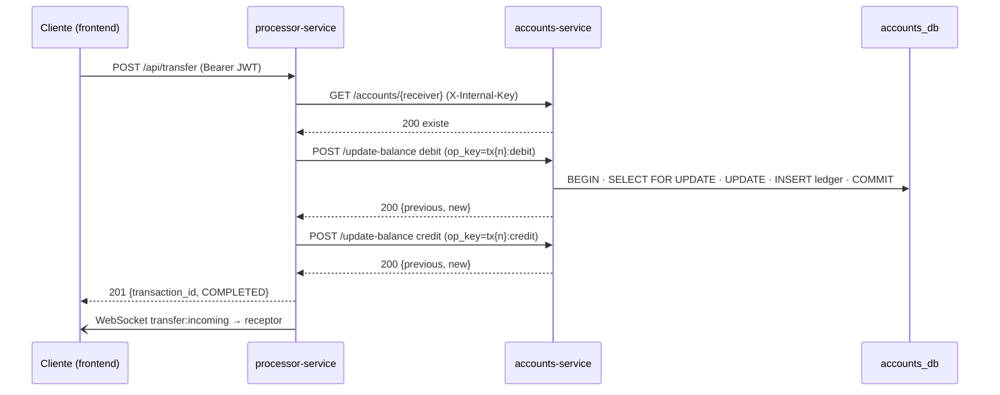

# Arquitectura — NeoWallet (Escenario 2)

Documento de decisiones arquitectónicas del sistema de pagos P2P **NeoWallet**.
Dirigido a arquitectos, lead devs y revisores que necesiten entender **qué** se
construyó y, sobre todo, **por qué**.

---

## 1. Visión general

NeoWallet es una billetera digital de pagos **peer-to-peer** construida con una
arquitectura de **microservicios** y **una base de datos por servicio**
(*database-per-service*). Los servicios se comunican exclusivamente por **HTTP/REST**;
no comparten base de datos ni memoria. Un **frontend Next.js** consume las APIs y
recibe notificaciones en **tiempo real** vía WebSocket.

El requisito rector del sistema es: **el dinero ni se crea ni se destruye** — la
suma total de saldos permanece constante salvo recargas explícitas (RNF-006).

```
   navegador (web / móvil)
        │  REST + WebSocket
        ▼
   frontend (Next.js)  :3002
        │
        ├───────────────► accounts-service :3000 ──► accounts_db   (Postgres :5432)
        │                        ▲
        │                        │ HTTP interno (X-Internal-Key)
        └───────────────► processor-service :3001 ─► processor_db  (Postgres :5433)
                                 │
                                 └── WebSocket (Socket.IO) ──► dispositivos
```

---

## 2. Servicios

| Servicio | Puerto | Responsabilidad | Base de datos | Tablas |
|----------|--------|-----------------|---------------|--------|
| **frontend** | 3002 | UI (login, dashboard, transferir, recargar, historial) | — | — |
| **accounts-service** | 3000 | Usuarios, saldos, autenticación (JWT) | accounts_db | `users`, `applied_operations` |
| **processor-service** | 3001 | Transferencias P2P (Saga), historial, gateway WebSocket | processor_db | `transactions` |

Cada microservicio sigue una estructura **MVC por capas**: `routes → controllers
→ services → models`, con `config/` (conexión, auth, migraciones) y `middlewares/`.

---

## 3. Comunicación entre servicios

El `processor-service` **nunca toca la tabla `users`**: para mover saldos llama al
`accounts-service` por HTTP. Esto mantiene el desacoplamiento *database-per-service*.



---

## 4. Decisiones arquitectónicas

### 4.1 ¿Por qué microservicios con base de datos por servicio?

Lo exige el escenario, pero además aísla los dominios: *cuentas* (estado del
dinero) y *procesamiento* (orquestación de transferencias) escalan y fallan de
forma independiente. La frontera de red es deliberada: obliga a tratar la
transferencia como una **transacción distribuida**, no como un simple `UPDATE`.

### 4.2 PostgreSQL y precisión monetaria

Se usa `DECIMAL(10,2)` (no `float`) para los saldos: el dinero no admite errores
de punto flotante. La regla `CHECK (balance >= 0)` a nivel de motor es la última
línea de defensa contra saldos negativos, independiente del código de aplicación.

### 4.3 Transferencia como Saga con compensación

No hay transacción ACID que abarque dos bases de datos. Se implementa el patrón
**Saga**: la transferencia avanza por pasos (`PENDING → DEBITED → COMPLETED`) y,
si el crédito al receptor falla, se ejecuta una **compensación** que devuelve el
dinero al emisor (`ROLLED_BACK`). Ver detalle en [§6](#6-resiliencia-y-consistencia).

### 4.4 Idempotencia de extremo a extremo (decisión clave)

El mayor riesgo de un Saga sobre HTTP es la **ambigüedad del timeout**: un error
de red puede significar *"no se aplicó"* o *"se aplicó pero se perdió la respuesta"*.
Asumir lo primero destruye, crea o duplica dinero. Por eso:

- **Idempotencia de la intención:** `POST /api/transfer` acepta `idempotency_key`;
  un índice único + `ON CONFLICT` evita crear una segunda transferencia ante un
  reintento.
- **Idempotencia de cada movimiento:** cada *leg* (`debit`/`credit`/`compensate`)
  lleva una `op_key` estable (`tx{id}:debit`, …). El `accounts-service` registra
  cada operación en el ledger `applied_operations` y **no la aplica dos veces**.
- Gracias a esto, **reintentar es seguro**: un timeout que en realidad sí se
  confirmó se resuelve en el reintento devolviendo el resultado guardado.

### 4.5 Autenticación stateless (JWT)

El `accounts-service` (dueño de los usuarios) emite un **JWT** en el login. El
secreto (`JWT_SECRET`) es **compartido** por variable de entorno, de modo que el
`processor-service` verifica el mismo token sin consultar a nadie (stateless,
escalable). La autoridad sobre el `id` del usuario vive en el token: el `sender_id`
de una transferencia y el `user_id` de una recarga **se toman del token, nunca del
body** → un usuario no puede operar sobre una cuenta ajena.

### 4.6 Tiempo real mediado por servidor (WebSocket)

Para la sensación "P2P en vivo" se usa **Socket.IO** sobre el `processor-service`
(no conexiones device-to-device, inseguras y frágiles para dinero). El servidor
sigue siendo la **única autoridad** y solo *empuja notificaciones*: cada usuario
se une a su room `user:{id}` (autorizado por JWT en el handshake) y recibe
`transfer:incoming` cuando le llega dinero.

---

## 5. Seguridad

- **JWT** firmado con secreto compartido; expira (`JWT_EXPIRES_IN`, 12h por defecto).
- **Autorización por propietario**: el id se deriva del token, no del input.
- **Endpoint interno** `update-balance` protegido con `INTERNAL_API_KEY`
  (servicio-a-servicio); un usuario final no puede invocarlo.
- **Hash de contraseñas** con bcrypt; nunca se almacenan en claro ni se incluyen en el token.
- **Consultas parametrizadas** en todo el acceso a datos (anti SQL-injection).
- **Arranque seguro**: en `NODE_ENV=production` el servicio **se niega a arrancar**
  si `JWT_SECRET`/`INTERNAL_API_KEY` están vacíos o usan el valor por defecto.
- **WebSocket autenticado**: el handshake exige JWT válido y solo permite unirse a la propia room.
- Pendiente para producción: **HTTPS/TLS**, rate-limit en login, API gateway.

---

## 6. Resiliencia y consistencia

Ciclo de vida de una transacción:

```
PENDING ──► DEBITED ──► COMPLETED        (éxito)
   │           │
   │           └──► ROLLED_BACK          (crédito falló → compensación OK)
   │           └──► FAILED               (compensación no confirmada → reconciliación)
   └──► FAILED                           (validación / receptor inexistente / fondos)
```

Mecanismos que garantizan que **no se pierde ni se crea dinero**:

1. **Atomicidad por operación**: cada débito/crédito usa `BEGIN + SELECT … FOR
   UPDATE + COMMIT`, bloqueando la fila para evitar condiciones de carrera.
2. **Saga con compensación**: si el crédito falla tras el débito, se revierte el débito.
3. **Idempotencia + reintentos con backoff** ante timeouts/5xx (no ante 4xx, que
   son definitivos): resuelve la ambigüedad de la red sin doble cobro (ver §4.4).
4. **Ledger de auditoría** (`applied_operations`): registra cada movimiento con su
   `op_key`, haciendo la conservación de dinero **demostrable** y dejando cualquier
   transacción `DEBITED`/`FAILED` recuperable por reconciliación sin riesgo de duplicar.
5. **`CHECK (balance >= 0)`**: imposible un saldo negativo aunque fallara el código.

> **Pendiente recomendado:** un *job de reconciliación* que cierre automáticamente
> transacciones que quedaron `DEBITED`/`FAILED` si la red estuvo caída más allá de
> los reintentos. El ledger idempotente ya deja ese cierre seguro.

---

## 7. Documentación de API

Cada servicio publica su especificación **OpenAPI 3.0** interactiva:

| Servicio | Swagger UI |
|----------|------------|
| accounts-service | http://localhost:3000/api-docs |
| processor-service | http://localhost:3001/api-docs |

El contrato detallado (endpoints, validaciones, ejemplos) está en
[`API_CONTRACT.md`](./API_CONTRACT.md); el modelo de datos en
[`../shared-infra/SCHEMA.md`](../shared-infra/SCHEMA.md).
