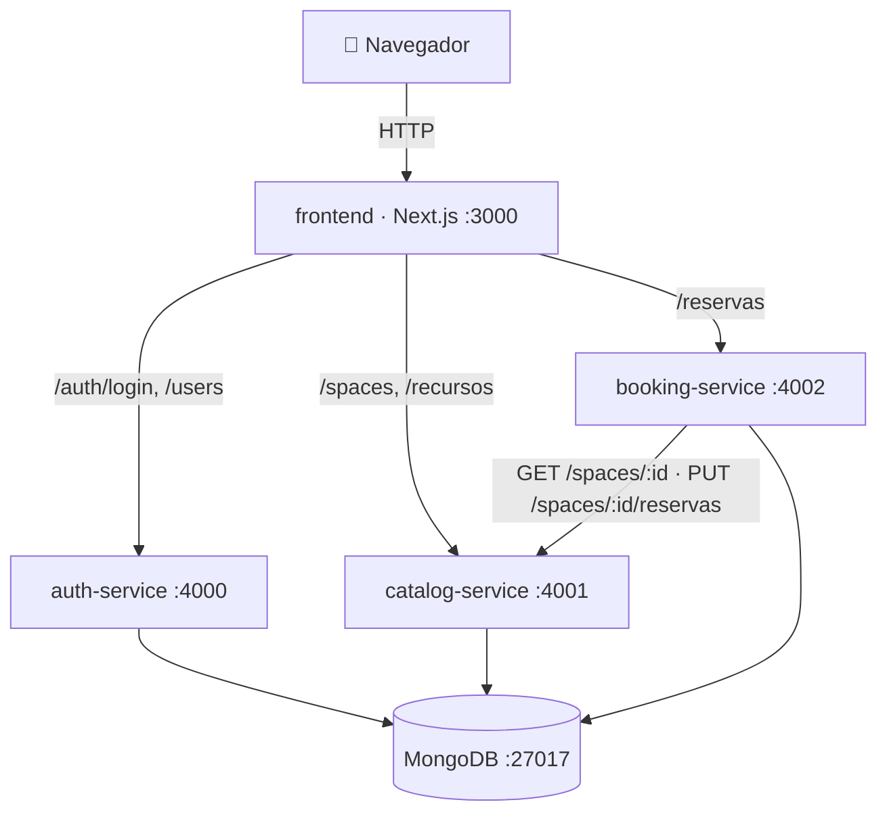

# OfficeSpace — Reserva de espacios de trabajo (IBM Hackathon 2026)

Arquitectura de **microservicios** dockerizados. Cada servicio corre en su propio
contenedor, con su propio puerto, proceso y `Dockerfile`, y se comunica con los
demás vía **HTTP**. Todos comparten una única instancia de **MongoDB**.

## Arquitectura

```
                          ┌──────────────────────────┐
   navegador  ─────────►  │   frontend (Next.js)      │  :3000
                          └─────────┬─────────────────┘
        llamadas HTTP del navegador │
        ┌───────────────┬──────────┴───────┐
        ▼               ▼                   ▼
 ┌─────────────┐ ┌──────────────┐  ┌──────────────────┐
 │ auth-service│ │catalog-service│  │  booking-service │
 │   :4000     │ │    :4001      │  │      :4002       │
 │  (JWT)      │ │  (espacios)   │  │   (reservas)     │
 └──────┬──────┘ └──────┬───────┘  └───┬──────────┬────┘
        │               │              │          │ HTTP: valida espacio
        │               │              │          └──────► catalog-service
        └───────────────┴──────────────┴────────┐
                                                 ▼
                                       ┌──────────────────┐
                                       │   MongoDB :27017  │
                                       │   db: officespace │
                                       └──────────────────┘
```

| Servicio          | Puerto | Rol                                        | Stack            |
|-------------------|--------|--------------------------------------------|------------------|
| frontend          | 3000   | UI (4 pantallas)                           | Next.js + React  |
| auth-service      | 4000   | Registro/login, emite JWT                  | Express          |
| catalog-service   | 4001   | CRUD de espacios                           | Express          |
| booking-service   | 4002   | Reservas (+ valida espacio vía HTTP)       | Express          |
| mongo             | 27017  | Base de datos compartida                   | MongoDB 7        |

## Diagrama de arquitectura (Mermaid)



Detalles y decisiones técnicas en [`docs/ARCHITECTURE.md`](docs/ARCHITECTURE.md).
Contrato de endpoints en [`docs/API_CONTRACT.md`](docs/API_CONTRACT.md).

## Documentación de API (Swagger / OpenAPI)

Cada servicio expone su documentación interactiva en `/api-docs`:

| Servicio        | Swagger UI                          |
|-----------------|-------------------------------------|
| auth-service    | http://localhost:4000/api-docs      |
| catalog-service | http://localhost:4001/api-docs      |
| booking-service | http://localhost:4002/api-docs      |

Incluye endpoints, parámetros, esquemas y códigos de respuesta (200/201/400/401/403/404/409/500).
Para probar endpoints protegidos: copia el `token` del login y pégalo en **Authorize** (Bearer).

## Requisitos cumplidos

- ✅ Cada servicio: puerto y proceso independiente, su propio `Dockerfile`.
- ✅ Comunicación **HTTP** entre servicios (booking → catalog), sin acceso directo a funciones.
- ✅ Cada servicio se puede desplegar/escalar por separado (`docker compose up <servicio>`).
- ✅ Middleware de **autenticación JWT** (obligatorio).
- ✅ Arquitectura limpia **MVC** (`controllers / services / models / routes / validators`).
- ✅ **4 pantallas** mínimas en el frontend.
- ✅ Esquema de documentos / diagrama de relaciones → [`shared-infra/SCHEMA.md`](shared-infra/SCHEMA.md).

## Cómo ejecutar (todo con Docker)

Requisitos: Docker + Docker Compose.

```bash
# 1. (Opcional) copia variables de entorno y define un JWT_SECRET propio
cp .env.example .env

# 2. Levanta TODO (construye imágenes la primera vez)
docker compose up --build

# 3. Abre la app
#    Frontend:        http://localhost:3000
#    Auth API:        http://localhost:4000/health
#    Catalog API:     http://localhost:4001/spaces
#    Booking API:     http://localhost:4002/health
```

La base de datos se inicializa con datos de ejemplo (3 espacios) vía
`shared-infra/init-mongo.js`.

### Comandos útiles

```bash
docker compose up -d --build       # en segundo plano
docker compose logs -f booking-service
docker compose up --build catalog-service   # reconstruir/escalar un solo servicio
docker compose down                # parar
docker compose down -v             # parar y BORRAR la base de datos
```

## Usuarios precargados (seeder)

No hay registro: los usuarios vienen del seeder `shared-infra/init-mongo.js`.

| usuario                                | password | rol           |
|----------------------------------------|----------|---------------|
| admin@corporativoalpha.com             | Admin123 | ADMINISTRADOR |
| carlos.mendez@corporativoalpha.com     | User123  | COLABORADOR   |
| ana.torres@corporativoalpha.com        | User123  | COLABORADOR   |

**Roles** (`ADMINISTRADOR` / `COLABORADOR`): el `ADMINISTRADOR` puede crear/editar/borrar
espacios en el catálogo; el `COLABORADOR` solo ve el catálogo y crea reservas. El rol
viaja en el JWT y se valida con el middleware `requireRole`.

## Flujo de prueba rápido

1. Entra a `http://localhost:3000` → te lleva al catálogo.
2. **Iniciar sesión** con alguno de los usuarios de arriba.
3. Abre un espacio → **reserva** un horario.
4. Ve a **Mis reservas** para verla o cancelarla.

## Guía de usuario

### Cómo iniciar sesión
1. Abre http://localhost:3000 → te redirige a la pantalla de **Login**.
2. Usa una de las credenciales de la tabla de arriba y pulsa **Entrar**.
   Si las credenciales son inválidas verás un mensaje de error.

### Cómo buscar y reservar un espacio (Colaborador)
1. En **Espacios**, usa el buscador o los **filtros de disponibilidad**
   (fecha + Desde/Hasta + tipo + capacidad mínima): el sistema mostrará solo
   los espacios **libres** en esa ventana.
2. Abre un espacio → en el **calendario** los días con reservas salen marcados;
   las franjas ocupadas del día se listan en rojo.
3. Elige **día → hora de inicio → duración (máx. 8 h) → nº de asistentes**
   (no puede exceder la capacidad) y pulsa **Confirmar reserva**.
4. Revisa o cancela tus reservas en **Mis reservas** (solo se cancelan las
   `programadas`).

### Cómo administrar (Administrador)
1. Inicia sesión como admin → aparece la pestaña **Admin**.
2. **Ocupación:** estadísticas del día y agenda por espacio.
3. **Reservas:** todas las reservas (con filtro por estado) y **exportación a
   Excel/CSV** con un clic — el reemplazo del antiguo Excel compartido, generado
   por el sistema y siempre actualizado.
4. **Usuarios / Recursos / Espacios:** alta, edición y borrado (CRUD). Al crear
   un espacio defines tipo, capacidad, ubicación y los recursos que incluye.

## Pruebas

- Casos de prueba manuales: [`tests/TEST_CASES.md`](tests/TEST_CASES.md)
- Escenarios BDD (Gherkin): [`tests/features/`](tests/features/)
- Colección de Postman: [`tests/postman/OfficeSpace.postman_collection.json`](tests/postman/OfficeSpace.postman_collection.json)
- Integración continua (Jenkins): [`Jenkinsfile`](Jenkinsfile) · guía en [`docs/CI.md`](docs/CI.md)

## Desarrollo local sin Docker

Cada servicio tiene su propio `README.md` con instrucciones (`npm install && npm run dev`).
Necesitas un MongoDB corriendo en `localhost:27017` (o ajusta `MONGO_URI`).

## Estructura

```
officespace-starter-2026/
├── auth-service/        # Microservicio C: autenticación (JWT)
├── catalog-service/     # Microservicio A: espacios
├── booking-service/     # Microservicio B: reservas (+ validators)
├── frontend/            # Next.js (4 pantallas)
├── shared-infra/        # init-mongo.js, SCHEMA.md, scripts
├── docker-compose.yml   # Orquestación
└── README.md
```
