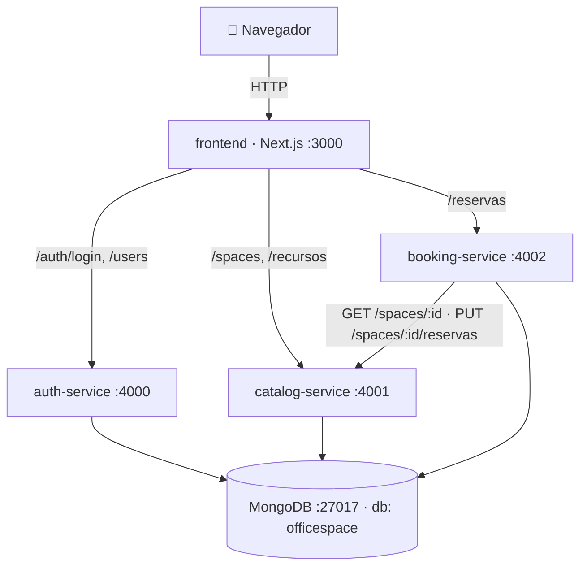
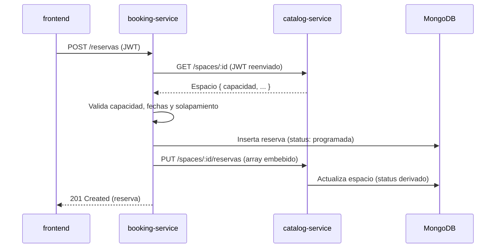

# Arquitectura — OfficeSpace

## 1. Visión general

OfficeSpace es una aplicación de **microservicios con base de datos compartida**
(arquitectura híbrida). Cada servicio es un proceso independiente, con su propio
puerto y `Dockerfile`, y se comunica con los demás **vía HTTP** (nunca por acceso
directo a funciones o a colecciones de otro servicio).

## 2. Servicios

| Servicio          | Puerto | Responsabilidad                                   | Colección(es)        |
|-------------------|--------|---------------------------------------------------|----------------------|
| `frontend`        | 3000   | UI (Next.js/React)                                | —                    |
| `auth-service`    | 4000   | Login (JWT) y gestión de usuarios                 | `users`              |
| `catalog-service` | 4001   | CRUD de espacios y recursos                       | `spaces`, `recursos` |
| `booking-service` | 4002   | Motor de reservas y validaciones                  | `reservas`           |
| `mongo`           | 27017  | Base de datos compartida                          | (todas)              |

Cada microservicio sigue una arquitectura **MVC**: `routes → controllers →
services → models`, con `validators` y `middleware` (auth JWT, roles) propios.

## 3. Comunicación entre servicios (HTTP)

El caso clave es la creación de una reserva:

`booking-service` **no** consulta la colección `spaces` directamente: pide el
espacio por HTTP a `catalog-service` y le delega la actualización del estado.

## 4. Decisiones arquitectónicas

### 4.1 ¿Por qué microservicios con DB compartida?
- **Separación de responsabilidades** clara por dominio (auth / catálogo / reservas).
- **Comunicación vía HTTP/REST** entre servicios (práctica de microservicios real).
- **Despliegue/escalado independiente**: `docker compose up --build <servicio>`.
- **DB compartida** para reducir complejidad de transacciones en el contexto del
  hackathon, manteniendo la separación lógica (cada servicio es dueño de su colección).

### 4.2 Base de datos: MongoDB (NoSQL)
La especificación permite relacional o NoSQL. Elegimos **MongoDB** porque:
- El modelo de documentos encaja con `recursos[]` y `ubicacion{}` embebidos en `spaces`.
- Permite **embeber** las reservas activas dentro de cada espacio (ver 4.3).
- El esquema lógico está documentado en [`shared-infra/SCHEMA.md`](../shared-infra/SCHEMA.md).

### 4.3 Reservas embebidas + ciclo de vida
- `reservas` es el **registro maestro** (histórico completo) con estados
  `programada → progreso → finalizada` (`cancelada` si se anula).
- Cada `space` embebe en `reservasProgramadas[]` solo las reservas **activas**
  (programada/progreso). Al finalizar/cancelar salen del espacio pero permanecen
  en `reservas`.
- El `status` del espacio es su **nivel de disponibilidad** (`alta`/`baja`/`ninguna`),
  que `catalog-service` **deriva** de las horas reservadas hoy (jornada 07:00–22:00).
- Las transiciones por tiempo se recalculan en la rutina `sync` (al crear, cancelar,
  listar y vía `POST /reservas/sync`, pensado para un cron futuro).

### 4.4 Autenticación y roles
- **JWT** emitido por `auth-service`; payload `{ sub, usuario, rol }`.
- Cada servicio valida el token con un middleware (secreto compartido, *stateless*).
- Roles: `ADMINISTRADOR` (CRUD de espacios/recursos/usuarios) y `COLABORADOR`
  (buscar, reservar y gestionar sus reservas).

## 5. Seguridad
- Todas las rutas de datos requieren JWT válido (solo `POST /auth/login` y los
  `/health` son públicos).
- Escrituras de catálogo y gestión de usuarios restringidas a `ADMINISTRADOR`
  (middleware `requireRole`).
- Contraseñas hasheadas con **bcrypt** (cost 10); el hash nunca se serializa.

## 6. Resiliencia (tolerancia a fallos)

Al ser microservicios, cada uno puede fallar de forma aislada sin tumbar al resto:

- **Reconexión a MongoDB con reintentos** (backoff) en cada servicio: si la BD
  arranca lenta o se cae temporalmente, el servicio reintenta en vez de morir.
- **Handlers de proceso** (`unhandledRejection`, `uncaughtException`): los fallos
  inesperados se registran, no rompen el contenedor en silencio.
- **Manejo centralizado de errores** + **404 controlado** (siempre responde JSON
  con el código HTTP correcto).
- **Llamadas entre servicios con timeout**: si `catalog-service` no responde,
  `booking-service` devuelve `502` claro al crear una reserva; y las
  sincronizaciones de estado (`PUT /spaces/:id/reservas`) son **no críticas**
  (si fallan, la reserva igual se guarda y se registra el error).
- **Docker**: `restart: unless-stopped` y `healthcheck` de Mongo con
  `depends_on: condition: service_healthy`.
- **Frontend tolerante**: si un microservicio está caído, la UI muestra un mensaje
  claro ("No se pudo conectar con el servicio de…") en vez de romperse.

## 7. Documentación de API
Cada servicio expone **Swagger UI** en `/api-docs` (ver [`API_CONTRACT.md`](API_CONTRACT.md)).
